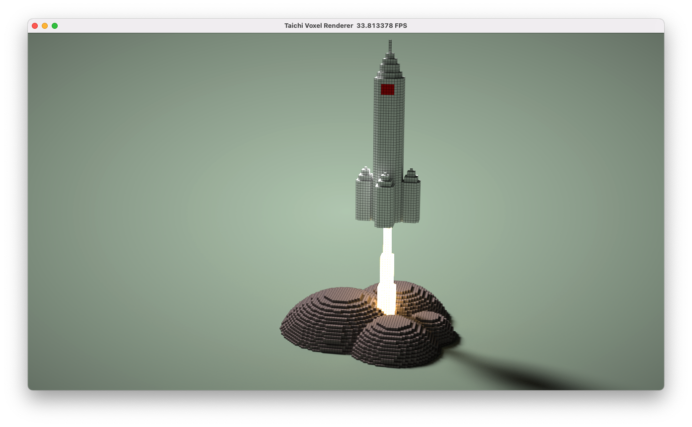

# Taichi Voxel Challenge

## Installation

Assume you have a Python 3 environment properly, you can simply run:

```sh
pip3 install -r requirements.txt
```

to install the dependendies of the voxel renderer.

Please fill in your code in `main.py` and include your result in this README.md file.

## Demo


## Quickstart

```sh
python3 main.py
```

Mouse and keyboard interface:

+ Drag with your left mouse button to rotate camera.
+ Press `W/A/S/D/Q/E` to move camera.
+ Press `P` to save screenshot.

